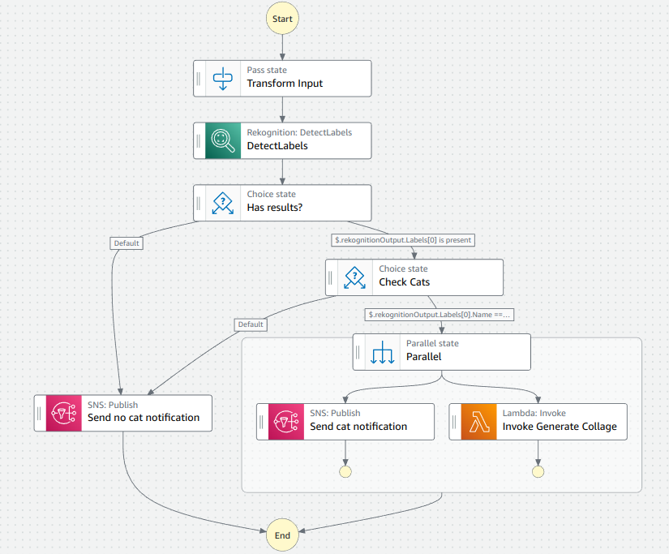

# cat-collage




## How does it work

## Project structure

This is a CDK project written in Typescript. It follows a normal NodeJS project structure. You can find the infrastructure definition
under the `lib` folder.

Inside the `generate-collage`, you will find the implementation of the Lambda function that generates the collage.
This code is written in Python, and a Dockerfile is provided to run it in AWS Lambda. CDK will handle the building process
when you run `cdk deploy` (see the next section).

Inside the `get-upload-endpoint`

## Set up

Create a .env file with your AWS credentials:
```
cd cat-collage
cp .env.example .env
nano .env
```

To run this project, you will need CDK. You can install it on your system or just use the `Dockerfile.cdk` image, which includes the AWS CLI as well:

```
sudo docker build -t cat-collage-cdk -f Dockerfile.cdk .
```

Once you have the Docker image built, you can run CDK commands:

```
sudo docker run -it --env-file .env -v $PWD:/home/node cat-collage-cdk cdk help
```

The first time you run this project, you will need to bootstrap your CDK environment in your AWS account:

```
docker run -it --env-file .env -v $PWD:/home/node cat-collage-cdk cdk bootstrap
```

Once this process is completed, you will be able to deploy the infrastructure with:

```
docker run -it --env-file .env -v $PWD:/home/node -v /var/run/docker.sock:/var/run/docker.sock cat-collage-cdk cdk deploy --parameters NotificationPhone=<<YOUR_PHONE_NUMBER_WITH_PREFIX or 0>>
```
Note: we need to bind the Docker socket so that the Docker installed inside the container can communicate with the Docker daemon installed in the host system. The reason for this is that CDK needs to build the Docker image of the Lambda function that generates the collage.

Once the deploy process is finished, some resources will have been created. The most important one are:
- Input S3 bucket. You can drop your files here and the Step Function will generate a collage.
- Output S3 bucket. The collage will be generated here.
- Step Function.

To try the project, simply drop a picture in the input S3 bucket and in a few seconds you will see the collage.png in your output bucket.

## Useful commands

You can see the differences between the infrastructure defined in your code and the infrastructure that exists in your AWS account:
```
<<<<<<< HEAD
docker run -it --env-file .env -v $PWD:/home/node cat-collage-cdk cdk diff
```