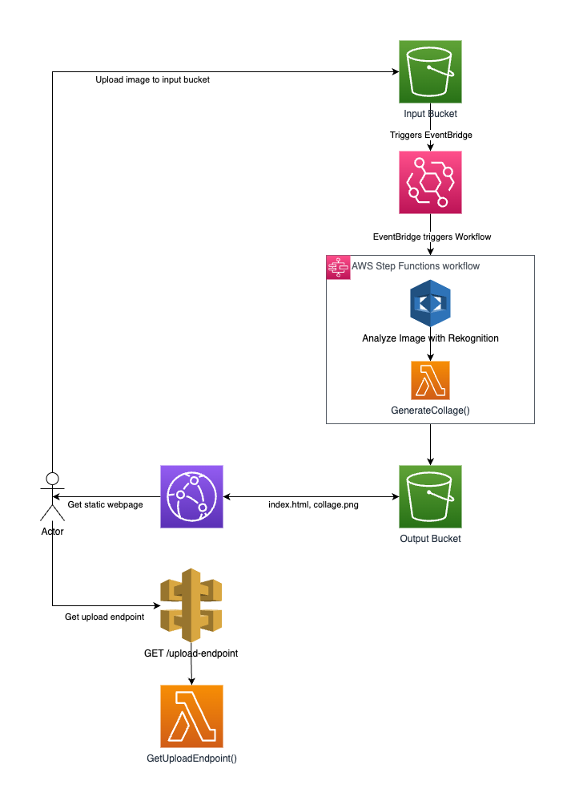

# The Purrfect Site 🐱
```
Cat as a Service project built with 100% serverless technology.
```

Introducing "The Purrfect Site" - where your cat's photo becomes a piece of the internet's coolest collage. Upload your feline friend's pic, and watch them join the ranks of internet-famous kitties

[thepurrfect.site](https://thepurrfect.site)

## How does it work

This is a CDK based project. We have three components:
- Static webpage, stored in S3 and served by CloudFront.
- API with a single endpoint to create a presigned URL that makes it possible for the static page to upload a file to the input S3 Bucket.
- Image processing Step Function, that is triggered when a file is uploaded and generates the collage.



## Project structure

This is a CDK project written in Typescript. It follows a normal NodeJS project structure. You can find the infrastructure definition
under the `lib` folder.

Inside the `generate-collage`, you will find the implementation of the Lambda function that generates the collage.
This code is written in Python, and a Dockerfile is provided to run it in AWS Lambda. CDK will handle the building process
when you run `cdk deploy` (see the next section).

Inside the `get-upload-endpoint`

## Set up

Create a .env file with your AWS credentials:
```
cd the-purrfect-site
cp .env.example .env
nano .env
```

To run this project, you will need CDK. You can install it on your system or just use the `Dockerfile.cdk` image, which includes the AWS CLI as well:

```
sudo docker build -t the-purrfect-site-cdk -f Dockerfile.cdk .
```

Now, install the NodeJS dependencies:
```shell
sudo docker run -it --env-file .env -v $PWD:/home/node the-purrfect-site-cdk npm install
```

Once you have the Docker image built, you can run CDK commands:

```
sudo docker run -it --env-file .env -v $PWD:/home/node the-purrfect-site-cdk cdk help
```

The first time you run this project, you will need to bootstrap your CDK environment in your AWS account:

```
docker run -it --env-file .env -v $PWD:/home/node the-purrfect-site-cdk cdk bootstrap
```

Once this process is complete, you will be able to deploy the infrastructure with:

```
docker run -it --env-file .env -v $PWD:/home/node -v /var/run/docker.sock:/var/run/docker.sock the-purrfect-site-cdk cdk deploy
```
Note: we need to bind the Docker socket so that the Docker installed inside the container can communicate with the Docker daemon installed in the host system. The reason for this is that CDK needs to build the Docker image of the Lambda function that generates the collage.

Once the deployment process has finished, some resources will have been created. The most important one are:
- Input S3 bucket. You can drop your files here and the Step Function will generate a collage.
- Output S3 bucket. The collage will be generated here.
- Step Function.

## Useful commands

You can see the differences between the infrastructure defined in your code and the infrastructure that exists in your AWS account:
```
docker run -it --env-file .env -v $PWD:/home/node the-purrfect-site-cdk cdk diff
```
